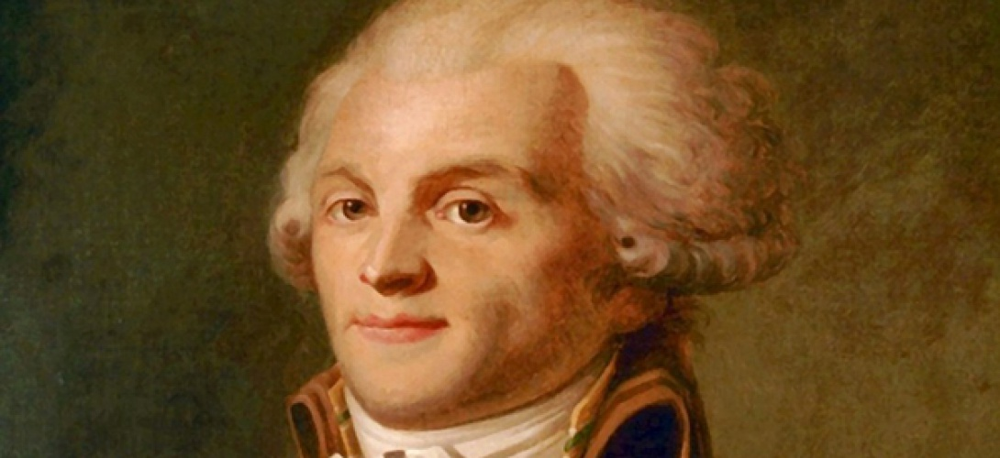

>>>>>> Beaucoup de choses sont dites sur Robespierre: à tort, à raison.  
Ici, il ne s'agit pas de trancher sur le personnage historique mais simplement de prendre connaissance de la singularité de cette citation sur le sens que donne cette figure historique à l'humanité.

<i class="fa fa-quote-left fa-lg fa-pull-left fa-border" style="color: #737373"></i>En qualité de Français, de représentant du peuple, je déclare que je déteste le peuple anglais (...) Je ne m'intéresse aux Anglais qu'en qualité d'homme; alors, j'avoue que j'éprouve quelque peine à en voir un si grand nombre soumis à des scélérats (...) Cette peine chez moi est si grande que j'avoue que c'est dans la haine de son gouvernement que j'ai puisé celle que je porte à ce peuple. <i class="fa fa-quote-right fa-lg" style="color: #737373"></i>

===

École française du XVIIIe siècle, Portrait de Maximilien Robespierre, musée Carnavalet.

>>> source:  
>>> [Alphonse AULARD, La société des Jacobins recueil de documents pour l'étude de la société des Jacobins t. 5 p. 633 cité par Sophie WAHNICH](http://gallica.bnf.fr/ark:/12148/bpt6k116856j/f640.image)

{.left}
>**Texte intégral:** le texte extrait figure en **gras**

**ROBESPIERRE:** — On veut séparer le peuple anglais de son gouvernement ; je ne demande pas mieux, à condition qu'on distinguera　aussi le peuple anglais faisant la guerre à la liberté, conjointement　avec son gouvernement, du peuple anglais punissant ce même gouvernement de ses attentats centré la liberté. Qu'est-ce que cette anglomanie, déguisée sous le masqué de la philanthropie, si ce n'est　la conservation de l'ancien brissotisme, qui négligea le bonheur et　la tranquillité de son pays pour aller s'occuper de la liberté de la
Belgique ? _(Applaudi.)_

Assurez votre liberté avant de vous occuper de celle des autres.
_(Applaudi.)_

Pourquoi veut-on que je distingue un peuple qui se rend complice des crimes de son gouvernement, de ce gouvernement si perfide ? Je n'aime pas les Anglais, moi _(applaudissements)_, parce que　ce mot me rappelle l'idée d'un peuple insolent osant faire la guerre　au peuple généreux qui a reconquis sa liberté. Je n'aime pas les　Anglais, parce qu'ils ont osé entrer dans Toulon pour y proclamer un　roi ; ce que n'a pas voulu souffrir le peuple qui a reconquis ses droits.
Je n'aime pas les Anglais, parce que leur gouvernement, perfidement　machiavélique envers le peuple même, qui le souffre, parce que ce　même gouvernement a osé dire et proclamer qu'il ne fallait garder　aucune foi, aucune règle d'honneur avec les Français dans cette guerre, parce que c'était un peuple de rebelles qui avait foulé aux
pieds les lois les plus saintes ; parce　qu'une partie du peuple, les　matelots, les soldats, à soutenu par les armes cette odieuse proclamation. **En qualité de Français, de représentant du peuple, je déclare que je hais le peuple anglais.** _(Applaudi.)_ Je déclare que j'augmenterai autant qu'il sera en moi la haine de mes compatriotes
contre lui. Que m'importe ce qu'il en pense ! Je n'espère qu'en nos soldats et en la haine profonde qu'ont les Français pour ce peuple.

**Je ne m'intéresse au peuple anglais qu'en qualité d'homme ; alors j'avoue que j'éprouve quelque peine à en voir un si grand nombre lâchement soumis à des scélérats qui les conduisent insolemment.
Cette peine chez moi est si grande que j'avoue que c'est dans ma haine pour son gouvernement que j'ai puisé celle que je porte à ce peuple** ; qu'il le détruise donc, qu'il le brise. Jusqu'alors je lui voue
une haine implacable. Qu'il anéantisse son gouvernement ; peut-être pourrions-nous encore l'aimer. Nous verrons si un peuple de marchands vaut un peuple agriculteur ; nous verrons si quelques vaisseaux valent nos terres fertiles. Il est quelque chose de plus méprisable encore qu'un tyran, ce sont des esclaves. _(Applaudissements. )_

On dit le roi Georges imbécile, et c'est bien prouvé ; mais ceux qui sont ses agents sont encore plus imbéciles que lui. On dit Pitt corrompu ; ceux qu'il emploie le sont bien davantage.

Il est un parti de l'opposition ; à la bonne heure ! Nous allons bientôt voir de quoi il est capable ; nous allons voir les débats de la rentrée du parlement. Mais si les communes votent une adresse de remerciement, alors le peuple anglais ne vaut plus la peine d'être gouverné ; qu'on cesse de s'occuper de cette nation méprisable, Nous ne pourrions que l'aimer ou la craindre ; dans ce dernier cas, il faudrait la replonger dans l'Océan. Enfin, ce n'est point à nous à faire les frais de la révolution d'Angleterre. Qu'on voie ce peuple s'affranchir lui-même, et nous lui rendrons toute notre estime et notre amitié. Quant à nous, formons notre marine, serrons de toutes parts nos forces, et achevons paisiblement une révolution si heureusement
commencée. Je réitère ma profession de foi : je détesterai de toute mon âme le peuple anglais tant qu'il sera asservi honteusement sous des despotes. Devenu libre, il aura peut-être encore des droits à mon admiration.